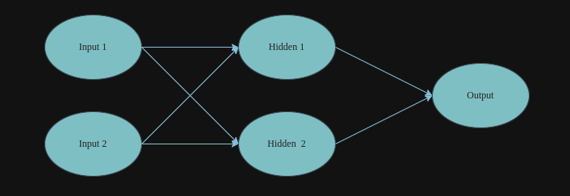
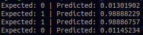
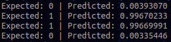

# Multi-Layer Perceptron for XOR Logic Gate

This file has my implmentation of a multi-layer perceptron set up to train on data pertaining to the XOR logic gate. Minor alterations to the training data could change this model to work with AND, OR, and other two-input logic gates.

As we discussed in class, the model uses repeated forward and backward propagation to to train. There are a couple of parameters that can be altered to slightly tweak the training, that being ```epochs```, the number of training sets performed, and ```learning_rate```, the proportion by which updates affect the network. Currently, those values are set to:

```python3
    epochs = 100000
    learning_rate = 0.1
```

The MLP has the following structure:



## Output

When given the aforementioned values of `epochs` and `learning_rate`, the following output is printed in the terminal.



With a higher number of epochs, the predictions would be more accurate, but the model will take longer to train. I tested the same code with 

```python3
    epochs = 1000000
```

and obtained the following result



As can be seen, the results are closer to the expected value, but not by much. Thus, while there is some value to increasing the number of epochs, the returns are diminishing. Overall, the model is very accurate.

## Usage

To run this module, ensure that you have numpy installed:

```bash
    pip install numpy
```

Run the `xor-mlp.py` to train the MLP and evaluate its performance.
